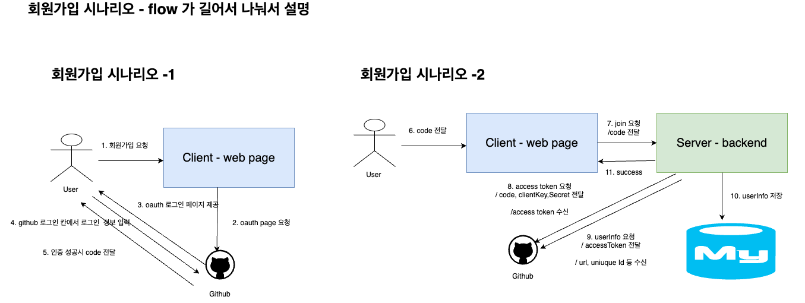
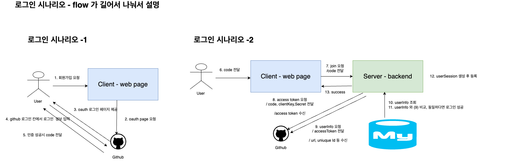

# 개요

- 로그인, 회원가입 내용에 대해 다룹니다.
- 백엔드에서 인증 과정에 대해 다룹니다.


# OAuth 로그인 & 회원가입 플로우 

- github oauth 를 통한 로그인 / 회원가입을 제공합니다.
  
- github info 의 키 값으로 github oauth 에서 제공하는 unique_id 를 사용합니다. 
  ( userEntity 의 id:Long 과는 다른 값임에 유의)
  
- client-side <-> Github api server  , user <-> Github , backend <-> server  등 과정이 복잡합니다.

## 회원가입 플로우 




## 로그인 플로우 

# 로그인 과정 



### 요약

1. 클라이언트 사이드에서 github oauth Login page 를 리디렉팅 해줍니다.

2. github oauth 인증이 통과하면 code (github에서 제공) 을 통해 백엔드에서 github api 를 통해
   user 정보를 쿼리해서 인증을 진행합니다.

3. 로그인 성공한다면 session 에 User 정보를 등록합니다 .

# 요청 검증

해당 서비스에서는 요청을 검증할 때 아래의 값을 기준으로 요청을 검증합니다.

1. userId 
	-  redis session 에 저장된 유저 세션객체, (Cookie:JSESSIONID 에 의해 조회 가능)
	  
2.  ipv4
	- 요청의 x-forwarded-for 에 의해 조회되는 ipv4 


## 요청 검증 - 아티클 , 댓글 

1. 아티클 생성
	- 로그인한 유저만 CUD 가능 


2. Favorite 등록 
	- 로그인한 유저만 CUD 가능 


3. 댓글 등록
	- x-forwarded-for 에 ip 를 명시했다면 CUD 가능
	- ip에 대한 black list 가 있음 

4. 그 외 조회 기능 (검색, 단건 조회)
	- 검증 절차 없음 .


# backend 에서 session 과 ip 관리 


### 주요 모듈 
- client:session-client 모듈 
- common:devwiki-common


#### client:session-client 

###### 주요 의존성 
- spring-security
- spring-redis-session 

###### 기능 
- http 요청 수신 시 security filter 에서 UserContext 를 생성하고 SecurityContext , redis Session 에 저장 혹은 조회 .


###### 주요 내용 

- security 필터 중, session 객체를 생성 or 조회 하고, UserContext 에 ip 등록 

```java
@Slf4j  
@RequiredArgsConstructor  
public class SessionFilter extends OncePerRequestFilter {  
  

...
  
    @Override  
    protected void doFilterInternal(HttpServletRequest request, HttpServletResponse response, FilterChain filterChain) throws ServletException, IOException {  
        // 세션 읽기 or 초기화  
        HttpSession session = request.getSession(true);  
        String clientIp = getClientIp(request);  
  
        // 로그 찍기  
        logSessionDetails(session);  


		// Token 생성 
        UsernamePasswordAuthenticationToken authentication = createAuthentication(session, clientIp);  
        
        SecurityContextHolder.getContext().setAuthentication(authentication);  
  
        filterChain.doFilter(request, response);  
    } 
     
...


	private UsernamePasswordAuthenticationToken createAuthentication(HttpSession session, String clientIp) {  
	    var userContext = redisSessionReader.getUserContextFromRedisSession(session.getId()).withIp(clientIp);  
	  
	    Set<GrantedAuthority> authorities = getAuthorities(userContext.getUserRoles());  
	  
	    return new UsernamePasswordAuthenticationToken(userContext, session.getId(), authorities);  
	}

}
```


-해당 서블릿 컨텍스트의 UserContext 조회 

아래 함수를 통해 위의 filter 에 등록된 세션 정보를 UserContext 형식으로 조회할 수 있습니다. 

```java
public class SecurityContextHolderUtil {  
  
    public static Optional<UserContext> getUserContext() {  
        var authentication = SecurityContextHolder.getContext().getAuthentication();  
  
        if (authentication == null)  
            return Optional.empty();  
  

        var principal = authentication.getPrincipal();  
        if (principal.equals("anonymousUser"))  
            return Optional.empty();  
  
        return Optional.of((UserContext) principal);  
    }  
}


```


```java 
@Getter  
@ToString  
public class UserContext {  
  
    private final String sessionId;  
    private final Long userId;  
    private final Set<UserRole> userRoles;  
    private final Set<UserStatus> userStatuses;  
    private final LocalDateTime registeredAt;  
    private final LocalDateTime refreshable;  
    private final String ip;
    ....

```


# 리소스 오너 저장하기 

## 개요 

- 리소스를 등록할 때, 로그인이 필요로 할지에 대한 내용이 바뀔 수 있다는 가정하에 적용한 내용입니다.

- 테이블에 저장할 때, 리소스의 소유자를 userId 로 저장 하지 않고 아래의 클래스, 테이블로 관리하게 합니다. 

- core-rdms 테이블에서 사용합니다. (상위 모듈에선 더 일반적인 표현인 UserIdentifier 를 사용해주세요.)
  
```
ResourceOwner {
  resourceOwnerId:Long,
  ownerType: OwnerType,
  ipv4:String,
  userId:Long
}
```


## Entity 예시 

아래는 tech Article 의 entity 를 선언할 때, 리소스 소유자에 대한 테이블을 선언하는 방법에 대한 예시입니다. 

##### Resource owner 부모 클래스 

```java
@MappedSuperclass  
@NoArgsConstructor  
@Getter  
public abstract class ResourceOwner<T extends ResourceOwner<T>> {  
    @Id  
    @Column(name = "resource_owner_id")  
    @GeneratedValue  
    private Long id;  
  
    @Enumerated(EnumType.STRING)  
    protected UserIdentifierType ownerType;  
  
    protected Long userId;  
    protected String ipv4;
...
```

##### techArticle 의 리소스 오너 클래스 ( 별도 테이블)

```java
@Entity  
@Table(indexes = {@Index(name = "index_on_ipvr", columnList = "ipv4"), @Index(name = "index_on_userId", columnList = "userId")})  
public class TechArticleResourceOwner extends ResourceOwner {  
}
```


##### 실제 엔티티 (techArticle)

```java
@Entity  
@Table(name = "tech_article")  
@NoArgsConstructor  
@Getter  
public class TechArticleEntity extends BaseEntity {  
  
    @Id  
    @GeneratedValue(strategy = GenerationType.IDENTITY)  
    @Column(name = "ARTICLE_ID")  
    private Long articleId;  
  
    @Column(name = "TITLE", nullable = false, length = 1024 * 1204)  
    @Setter  
    private String title;  
  
  
    @OneToOne(cascade = CascadeType.ALL)  
    @JoinColumn(name = "resource_owner_id")  
    private TechArticleResourceOwner resourceOwner;
    ...


---

[쿼리 예시 ] 
@Query("SELECT a FROM TechArticleEntity a JOIN FETCH a.resourceOwner WHERE a.resourceOwner.ipv4 = :ipv4")  
List<TechArticleEntity> findByResourceOwnerIpv4(String ipv4);  
  
@Query("SELECT a FROM TechArticleEntity a JOIN FETCH a.resourceOwner WHERE a.resourceOwner.userId = :userId")  
List<TechArticleEntity> findByResourceOwnerUserId(Long userId);

```


## UserIdentifier 

##### 예시 

domain service, web-module 에서 사용하는 요청자, 리소스 오너에 대한 식별자입니다.

ip, userId 둘 중 하나의 값을 가지도록 하는 값 클래스입니다. 
(생성, 조회 에는 같은 패키지의 UserIdentifierHelper.java 를 사용해주세요 )

```java
  
public interface UserIdentifier {  
}

public record LoginUserIdentifier(Long userId) implements UserIdentifier {  
}
 
public record Ipv4UserIdentifier(String ipv4) implements UserIdentifier {  
}

```


#### context-to-userIdentifier 

요청검증 시, api-service 의 파라미터로 UserIdentifier 를 넘겨받게 됩니다.
컨트롤러 단에서 UserContext 를 UserIdentifier 로 변경하는 예시입니다.


```java
@PostMapping  
public ResponseEntity<CreateTechArticleResponse> createTechArticle(  
        @RequestBody  
        @Parameter(required = true)  
        CreateTechArticleRequest request) {  
  
    var userIdentifier = identifierHolder.get();  
    var article = techArticleService.create(new CreateTechArticleCommand(  
            request.title(),  
            request.content(),  
            request.categories(),  
            userIdentifier  
    ));  
  
    return ResponseEntity.ok(new CreateTechArticleResponse(article.getArticleId(), "article created"));  
}

---

@Component  
public class DefaultIdentifierHolder implements IdentifierHolder {  
    @Override  
    public UserIdentifier get() {  
        var context = getUserContext();  
  
        if (isContextInvalid(context)) {  
            return null;  
        }  
  
        return createUserIdentifier(context.get());  
    }
    ...
    
```
